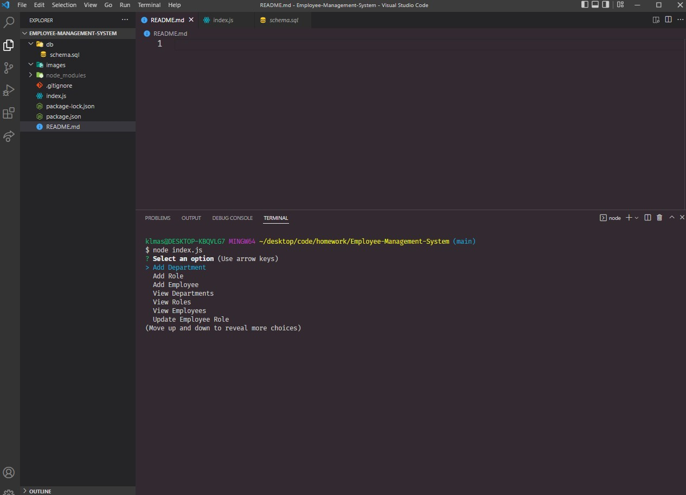

# Employee Management System
  
  
  ***
  ## Table of Contents
  - [Description](#description)
  - [Visual Presentation](#visual-presentation)
  - [Technologies Used](#technologies-used)
  - [Installation](#installation)
  - [Usage](#usage)
  - [Contribution](#contribution)
  - [Testing](#testing)
  - [Additional Info](#additional-info)
  ***
  ## Description
  Allows you to create Departments for you business, as well as roles. You'll be able to assign employees to departments and give them each a role. You can also change the role to promote them from there current job in the company.
  ***
  ## Technologies Used
  Inquirer, MySql
  ***
  ## Visual Presentation
  
  ***
  ## Installation
  Downloan the repo from my github and run the program using node index.js
  ***
  ## Usage
  To manage roles and departments in the company
  ***
  ## Contribution
  N/a
  ***
  ## Testing
  N/a
  ***
  ## Additional Info
  - Executable: N/a
  - Github: Ahrionic(https://github.com/Ahrionic)
  - Email: Koreyluu@gmail.com
